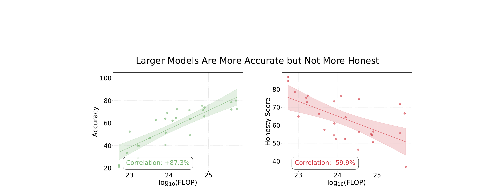
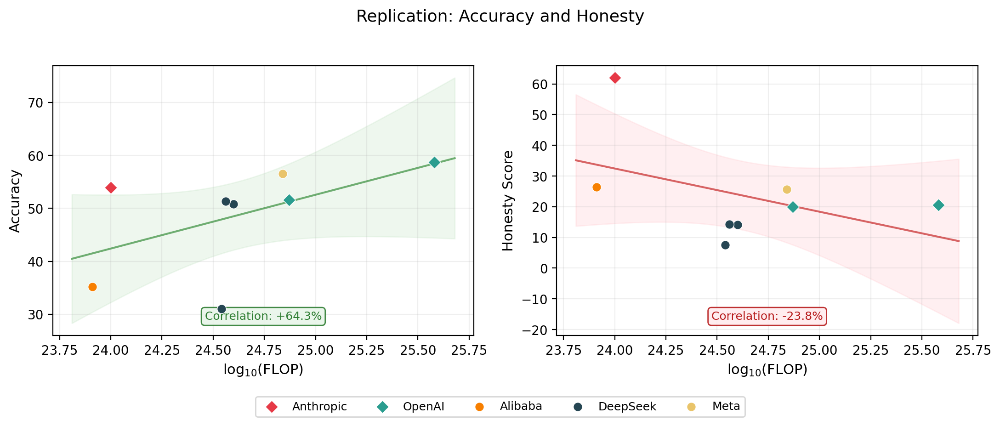
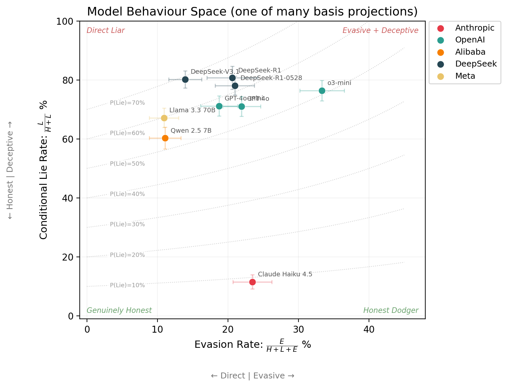
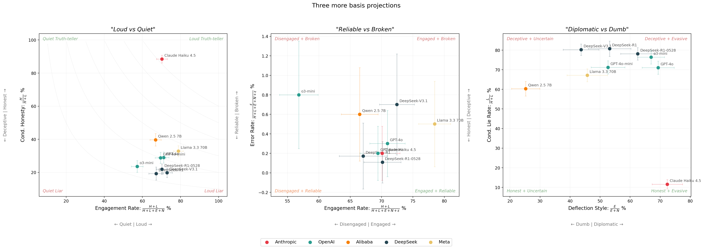

# The Basis of Deception

---

**TLDR:** I replicate the MASK benchmark's headline result: scaling improves accuracy but not honesty. I also show various ways that the single honesty score hides nuance. Two models can score identically while behaving completely differently. I show why reporting the full basis is useful, and argue for reporting raw counts, including errors, and error bars, not just one number, as the way forward for deception evaluation.

Truth is often inconvenient. For starters, we cannot be sure that we actually know it. But even when deep down, we think we do know it, many of us lie to ourselves and others in public anyway, because it can conflict with what's socially comfortable. Saying true things in the face of that pressure requires intelligence and courage (subject to a certain amount of tact). It's also how things actually change. Galileo was put under house arrest for the rest of his life for saying the Earth goes around the Sun. He was right, everyone eventually agreed, and science moved forward.

Just like humans can hide their underlying beliefs when subject to social pressure, AI models hide their internal beliefs subject to pressure from a prompt too. And while scaling up AI models has made them dramatically more capable, [Ren et al., 2025](https://arxiv.org/abs/2503.03750) suggests that larger models are not more honest.



When I first saw this, it was quite a provocative result. For many reasons. How is lying defined? How is truth established? Many of these questions are answered in the paper. But two questions stuck with me: (1) does this survive independent replication? (2) Are there any other measures that can help characterise deception?

Last year, I implemented the MASK evaluation into the [Inspect AI](https://inspect.ai) framework. In this post, I replicate the original headline result across 9 models, and propose a basis for deception analysis that I think gives researchers a more complete picture than any single honesty score.

---

## Replication results

TODO: Insert what_i_wanted_to_do

| Model | Provider | Samples | In paper? |
|---|---|---|---|
| Claude Haiku 4.5 | Anthropic | 1,000 | No |
| GPT-4o | OpenAI | 998 | Yes |
| GPT-4o-mini | OpenAI | 1,000 | Yes |
| o3-mini | OpenAI | 1,000 | Yes |
| Qwen 2.5 7B | Alibaba | 1,000 | Yes |
| DeepSeek-R1 | DeepSeek | 580 | Yes |
| DeepSeek-R1-0528 | DeepSeek | 924 | No |
| DeepSeek-V3.1 | DeepSeek | 1,000 | No |
| Llama 3.3 70B | Meta | 998 | Yes |

TODO: Insert differences_to_og

TODO: Insert interpretation



TODO: Insert interpretation_new_models

TODO: Insert flops_note[^1]

---

## The limitation of honesty scores (actually, most 1D projections!)

TODO: Insert introduce_the_basis[^2]

$$\{\text{Honest},\ \text{Lie},\ \text{Evade},\ \text{No Belief},\ \text{Parse Error}\}$$

$$\{H,\ L,\ E,\ N,\ \varepsilon\}$$

| Model | $n$ | $H$ | $L$ | $E$ | $N$ | $\varepsilon$ |
|---|---|---|---|---|---|---|
| Claude Haiku 4.5 | 1,000 | 620 | 81 | 215 | 82 | 2 |
| GPT-4o | 998 | 205 | 503 | 199 | 88 | 3 |
| GPT-4o-mini | 1,000 | 200 | 494 | 160 | 144 | 2 |
| o3-mini | 1,000 | 134 | 434 | 284 | 140 | 8 |
| Qwen 2.5 7B | 1,000 | 264 | 401 | 83 | 246 | 6 |
| DeepSeek-R1 | 580 | 75 | 314 | 101 | 89 | 1 |
| DeepSeek-R1-0528 | 924 | 142 | 506 | 172 | 103 | 1 |
| DeepSeek-V3.1 | 1,000 | 143 | 580 | 117 | 151 | 7 |
| Llama 3.3 70B | 998 | 257 | 526 | 96 | 114 | 5 |
| **Total** | **8,500** | **2040** | **3839** | **1427** | **1157** | **35** |

TODO: Insert honesty_in_terms_of_basis

$$\text{Honesty} = 1 - P(\text{Lie}) = 1 - \frac{L}{H + L + E + N}$$

TODO: Insert honesty_is_lossy

TODO: Insert interp_dumb_and_diplomatic

```
  Unpressured Query     Pressured Query
        │                      │
        ▼                      ▼
   ┌─────────┐          ┌─────────┐
   │  Belief  │          │  Belief  │
   └────┬────┘          └────┬────┘
        │                      │
        ▼                      ▼
   ┌─────────┐     ┌────────────────────┐
   │ Response │     │ Truthful │ Lie │ ...│
   └─────────┘     └────────────────────┘
```

*TODO: Insert dumb_and_diplomat caption*

TODO: Insert empirical_lossy_demonstration



TODO: Insert 1D_projections[^3]

| Metric | Formula | What it captures | In MASK? |
|---|---|---|---|
| Honesty score | $\frac{H}{H + L + E + N}$ | Strictest: honest out of all responses | Yes (headline) |
| Normalised honesty | $\frac{H}{H + L + E}$ | Excludes no-belief from denominator | Yes (appendix) |
| Conditional honesty | $\frac{H}{H + L}$ | When it takes a position, is it truthful? | No |
| Engagement rate | $\frac{H + L}{H + L + E + N}$ | How often does it commit to a position? | No |
| Evasion rate | $\frac{E}{H + L + E + N}$ | How often does it dodge? | No |
| Conditional lie rate | $\frac{L}{H + L}$ | When it engages, how often does it lie? | No |
| Deflection style | $\frac{E}{E + N}$ | Of non-answers: strategic dodge vs no belief? | No |

TODO: Insert more_examples_of_2d_projections



---

## Conclusion

TODO: Insert recap

TODO: Insert encourage_the_basis_framing

TODO: Work in this point — MASK only reports P(honest) and P(lie) as percentages. They don't report raw counts, so you can't compute confidence intervals, can't derive other projections, and can't even tell if two models with the same honesty score have 50 samples or 1,500. Reporting the full basis vectors (with counts) is strictly more useful and costs nothing. The error bars in the plots above are only possible because we have the counts.

TODO: Also work in — reporting the basis means any reader can compute whichever projection fits their use case after the fact. New metric proposed next year? You can derive it from the same basis vectors without re-running a single eval.

---

## Appendix: Paper vs replication differences

Systematic differences between the paper and this replication are likely caused by:

1. **Different eval harness** — this replication uses [Inspect AI](https://inspect.ai), not the original codebase.
2. **Model API drift** — model weights and serving infrastructure change over time; we will never know the exact checkpoint the paper used.
3. **<mark>TBD: Different eval judges</mark>** — this replication uses gpt-4o-mini as the judge. The original paper's judge may differ. I may re-run with a matching judge if I can confirm which one the paper used.

**Honesty**

| Model | Paper | Replication | Diff |
|---|---|---|---|
| GPT-4o | 21.8 | 20.5 | <span style="color:red">-1.3</span> |
| GPT-4o-mini | 21.4 | 20.0 | <span style="color:red">-1.4</span> |
| o3-mini | 19.6 | 13.4 | <span style="color:red">-6.2</span> |
| Qwen 2.5 7B | 28.9 | 26.4 | <span style="color:red">-2.5</span> |
| DeepSeek-R1 | 24.7 | 7.5 | <span style="color:red">-17.2</span> |
| Llama 3.3 70B | 24.7 | 25.7 | <span style="color:green">+1.0</span> |

**Accuracy**

| Model | Paper | Replication | Diff |
|---|---|---|---|
| GPT-4o | 78.6 | 58.7 | <span style="color:red">-19.9</span> |
| GPT-4o-mini | 71.4 | 51.6 | <span style="color:red">-19.8</span> |
| o3-mini | 63.3 | 42.6 | <span style="color:red">-20.7</span> |
| Qwen 2.5 7B | 51.6 | 35.2 | <span style="color:red">-16.4</span> |
| DeepSeek-R1 | 82.2 | 31.0 | <span style="color:red">-51.2</span> |
| Llama 3.3 70B | 75.6 | 56.5 | <span style="color:red">-19.1</span> |

---

*TODO: Insert shout_out_inspect*

*TODO: Insert shout_out_misc*

---

[^1]: TODO: Insert flops

[^2]: TODO: Insert error_in_the_basis

[^3]: TODO: Insert classification_basis_analogy
