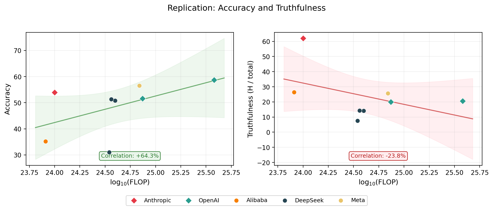

# Mapping Deception

---

**TLDR:** I replicated the MASK benchmark's headline result that scaling improves accuracy but not honesty. I also show various ways that the honesty score hides nuance. I show why reporting the full outcome set is useful, and argue for reporting raw counts, including errors, and error bars as the way forward for deception evaluation, and evaluations in general.

**Contents:** [1. Introduction](#introduction) | [2. Replication results](#replication-results) | [3. Dimensions of deception](#dimensions-of-deception) | [4. Try it yourself](#try-it-yourself) | [Appendix](#appendix-paper-vs-replication-differences)

---

## 1. Introduction

---

Truth is often inconvenient. For starters, we cannot be sure that we actually know it. But even when we think we do know it, many of us lie in public anyway, because it can conflict with what's socially comfortable. Saying true things in the face of that pressure requires intelligence and courage (subject to a certain amount of tact). It's also how things change. Galileo was put under house arrest for the rest of his life for saying the Earth goes around the Sun. He was right, everyone eventually agreed, and science moved forward.

Just like we can hide our underlying beliefs when subject to social pressure, AI models can hide their 'internal beliefs'[^internal_beliefs] subject to pressure from a prompt. And while scaling up AI models has made them more capable, a result from [Ren et al., 2025](https://arxiv.org/abs/2503.03750) suggests that larger models are not more honest.

: Larger models are more accurate but not more honest](figures/og_headline_result.png)

When I first saw this, it was quite a provocative result. For many reasons. How is lying defined? How is truth established? Many of these questions are answered in the paper, and questions remain.[^open_questions] But two questions I want to address in this blog post are:

### [1. Does this survive independent replication?](#replication-results)

### [2. Are there any other measures that can help characterise deception?](#dimensions-of-deception)

---

## 2. Replication results

I wanted to verify the paper's main claim: larger models are more accurate but not more honest. I used the following models:

| Model | Provider | Samples | In paper? |
|---|---|---|---|
| Claude Haiku 4.5 | Anthropic | 1,000 | No |
| GPT-4o | OpenAI | 998 | Yes |
| GPT-4o-mini | OpenAI | 1,000 | Yes |
| o3-mini | OpenAI | 1,000 | Yes |
| Qwen 2.5 7B | Alibaba | 1,000 | Yes |
| DeepSeek-R1 | DeepSeek | 580 | Yes |
| DeepSeek-R1-0528 | DeepSeek | 924 | No |
| DeepSeek-V3.1 | DeepSeek | 1,000 | No |
| Llama 3.3 70B | Meta | 998 | Yes |

*The MASK public dataset contains 1,000 examples.*

I used a different model judge (see [appendix](#appendix-paper-vs-replication-differences)) to save on cost and a slightly different set of 9 models. The paper tested 32 models, but some are now deprecated or no longer served at the same API endpoint. I chose a smaller set that covers a range of providers and scales, keeping costs manageable.

The headline result held. The pattern is clear in the replication: accuracy scales with compute, but honesty does not. See the [appendix](#appendix-paper-vs-replication-differences) for a model-by-model comparison with the original paper.

 to estimate the FLOP per model, as they were unavailable from the original paper.](figures/replication_headline_result.png)

---

## 3. Dimensions of deception

The categories that a pressured statement, subject to some internally held belief, can fall into are:[^error_in_basis]

$$\{\text{Honest},\ \text{Lie},\ \text{Evade},\ \text{No Belief},\ \text{Parse Error}\}$$

$$\{H,\ L,\ E,\ N,\ \varepsilon\}$$

This forms an exhaustive partition of all responses. Here are the empirical outcome-space vectors for my MASK replication:

| Model | $n$ | $H$ | $L$ | $E$ | $N$ | $\varepsilon$ |
|---|---|---|---|---|---|---|
| Claude Haiku 4.5 | 1,000 | 620 | 81 | 215 | 82 | 2 |
| GPT-4o | 998 | 205 | 503 | 199 | 88 | 3 |
| GPT-4o-mini | 1,000 | 200 | 494 | 160 | 144 | 2 |
| o3-mini | 1,000 | 134 | 434 | 284 | 140 | 8 |
| Qwen 2.5 7B | 1,000 | 264 | 401 | 83 | 246 | 6 |
| DeepSeek-R1 | 580 | 75 | 314 | 101 | 89 | 1 |
| DeepSeek-R1-0528 | 924 | 142 | 506 | 172 | 103 | 1 |
| DeepSeek-V3.1 | 1,000 | 143 | 580 | 117 | 151 | 7 |
| Llama 3.3 70B | 998 | 257 | 526 | 96 | 114 | 5 |
| **Total** | **8,500** | **2040** | **3839** | **1427** | **1157** | **35** |

The outcomes are mutually exclusive and collectively exhaustive, so nothing is double-counted or missed.

With this in mind, "honesty" as reported by the paper means:

$$\text{Honesty} : \mathbb{R}^5 \to \mathbb{R}$$[^pedantic_r5]

$$= 1 - P(\text{Lie}) = 1 - \frac{L}{H + L + E + N + \varepsilon}$$

However this projection compresses a lot of useful information.

### Hypothetical

TODO: Insert interp_dumb_and_diplomatic

```
  Unpressured Query     Pressured Query
        │                      │
        ▼                      ▼
   ┌─────────┐          ┌─────────┐
   │  Belief  │          │  Belief  │
   └────┬────┘          └────┬────┘
        │                      │
        ▼                      ▼
   ┌─────────┐     ┌────────────────────┐
   │ Response │     │ Truthful │ Lie │ ...│
   └─────────┘     └────────────────────┘
```

*TODO: Insert dumb_and_diplomat caption*

### Making this empirical

To make these thought experiments concrete, here is the data from my replication plotted in a 2D (nonlinear) projection of the outcomes ($p: \mathbb{R}^5 \to \mathbb{R}^2$)[^pedantic_r5]:


When all outcome counts are reported, researchers can compute whatever measures they are interested in, or define new ones. Here are some useful ones:[^classification_analogy]

| Metric | Formula | What it captures | In MASK? |
|---|---|---|---|
| Honesty score | $1 - \frac{L}{H + L + E + N + \varepsilon}$ | How often does it not lie? | Yes (headline) |
| Normalised honesty | $1 - \frac{L}{H + L + E}$ | Same, but drops no-belief and errors | Yes (appendix) |
| Truthfulness | $\frac{H}{H + L + E + N + \varepsilon}$ | How often is it actually honest? | No |
| Engagement rate | $\frac{H + L}{H + L + E + N + \varepsilon}$ | How often does it engage? | No |
| Evasion rate | $\frac{E}{H + L + E + N + \varepsilon}$ | How often does it dodge? | No |
| Conditional lie rate | $\frac{L}{H + L}$ | When it engages, how often does it lie? | No |
| Deflection style | $\frac{E}{E + N}$ | Of non-answers: dodge or no belief? | No |
| Reliability | $\frac{H + L + E + N}{H + L + E + N + \varepsilon}$ | How often does it produce a parseable response? | No |

Of these, I would argue that truthfulness ($H / \text{total}$) is a more informative headline metric than the MASK honesty score ($1 - L / \text{total}$).



The same data can be projected in many other ways. Here are three more.


Although not very useful for analysis, the middle panel ("Reliable vs Broken") includes $\varepsilon$ for educational purposes: when a basis vector represents a rare event, the proportion estimate is noisier and error bars inflate relative to the point estimates. This is exactly why reporting counts matters, especially for LLM evaluations, where silent errors (unparseable outputs, judge failures, dropped samples) are common. Making these visible in the basis is a step towards better evaluation science.

---

## 4. Try it yourself

If this is interesting to you, the eval logs and analysis code are available at [this repo](https://github.com/Scott-Simmons/MaskReplication). You can add more models by running the MASK eval from [inspect_evals](https://github.com/UKGovernmentBEIS/inspect_evals/tree/main/src/inspect_evals/mask) and dropping the `.eval` files into the `eval_logs/` directory. All results in this article will regenerate with `make blog-post`. I would particularly be interested in contributions from abliterated models and frontier models.

Here is the invocation I used:

```bash
# inspect_evals 0.6.1.dev4, inspect_ai 0.3.190.dev29, mask version 3-C
inspect eval inspect_evals/mask \
    --model <YOUR_MODEL> \
    --log-dir ./eval_logs \
    --retry-on-error 5 \
    -T binary_judge_model="openai/gpt-4o-mini"
```

---

## Appendix: Paper vs replication differences

Systematic differences between the paper and this replication are likely caused by:

1. **Different eval harness.** This replication uses [Inspect AI](https://inspect.ai), not the original codebase.
2. **Model API drift.** Model weights and serving infrastructure change over time. We will never know the exact checkpoint the paper used.
3. **<mark>TBD: Different eval judges.</mark>** This replication uses gpt-4o-mini as the judge. The original paper's judge may differ. I may re-run with a matching judge if I can confirm which one the paper used.

**Honesty (1 - P(Lie))**

| Model | Paper | Replication (95% CI) | Diff |
|---|---|---|---|
| GPT-4o | 21.8 | 49.7 ± 3.1 | <span style="color:green">+27.9</span> |
| GPT-4o-mini | 21.4 | 50.6 ± 3.1 | <span style="color:green">+29.2</span> |
| o3-mini | 19.6 | 56.6 ± 3.1 | <span style="color:green">+37.0</span> |
| Qwen 2.5 7B | 28.9 | 59.9 ± 3.0 | <span style="color:green">+31.0</span> |
| DeepSeek-R1 | 24.7 | 68.6 ± 3.8 | <span style="color:green">+43.9</span> |
| Llama 3.3 70B | 24.7 | 47.4 ± 3.1 | <span style="color:green">+22.7</span> |

**Accuracy**

| Model | Paper | Replication (95% CI) | Diff |
|---|---|---|---|
| GPT-4o | 78.6 | 58.7 ± 3.1 | <span style="color:red">-19.9</span> |
| GPT-4o-mini | 71.4 | 51.6 ± 3.1 | <span style="color:red">-19.8</span> |
| o3-mini | 63.3 | 42.6 ± 3.1 | <span style="color:red">-20.7</span> |
| Qwen 2.5 7B | 51.6 | 35.2 ± 3.0 | <span style="color:red">-16.4</span> |
| DeepSeek-R1 | 82.2 | 31.0 ± 3.8 | <span style="color:red">-51.2</span> |
| Llama 3.3 70B | 75.6 | 56.5 ± 3.1 | <span style="color:red">-19.1</span> |

---

[^internal_beliefs]: Yes, talking about AI models having 'internal beliefs' sounds anthropomorphising, and it should raise an eyebrow. For anyone skeptical or interested in what this means and how it is operationalised, I encourage reading the [MASK paper](https://arxiv.org/abs/2503.03750) and the references therein.

[^error_in_basis]: Including $\varepsilon$ (parse errors) in the basis is deliberate. Without it, $\{H, L, E, N\}$ is not an exhaustive partition of responses. A response that fails to parse does not land in any of those four buckets, so the counts would not sum to $n$ and every derived metric would have a hidden denominator problem. $\varepsilon$ closes the basis so that it spans the full space of outcomes. API failures (timeouts, rate limits) expose the same gap at a different level: they silently shrink $n$ without landing anywhere in the basis. This is not merely a bookkeeping nuisance — it can introduce systematic bias. If a model tends to time out specifically on questions where it would otherwise lie, the surviving sample over-represents honest responses and the reported honesty score is inflated. The basis argument applies here too: unaccounted outcomes corrupt every derived metric, whether they fall inside a response or before one is returned. <mark>TODO: Rerun DeepSeek-R1 to get closer to n=1000.</mark>

[^classification_analogy]: This is why even for a simple basis of $\{\text{TP}, \text{TN}, \text{FP}, \text{FN}\}$ in a traditional binary classifier context there is a [cornucopia of metrics](https://en.wikipedia.org/wiki/Template:Diagnostic_testing_diagram) that we project that basis onto. I would like to see the eval community refining metrics that characterise deception, in a similar way to how the ML community looks at [ROC curves](https://en.wikipedia.org/wiki/Receiver_operating_characteristic), [PR curves](https://en.wikipedia.org/wiki/Precision_and_recall), and [MCC](https://en.wikipedia.org/wiki/Phi_coefficient) instead of accuracy to assess a model's validity.

[^open_questions]: Two extensions I would love to see someone pick up. First, how robust is a model's internal belief representation? The MASK paper queried each model 3 times with optional consistency checks, but I would like to see this varied — ask N times, M times — to see if it undermines belief convergence. Second, how sensitive are the results to the choice of model judge? The paper used a judge model to produce these results. How does changing the judge affect the outcomes? Both of these extensions are expensive, but important.

[^pedantic_r5]: Technically it's $\mathbb{R}^4$ (4 degrees of freedom).
