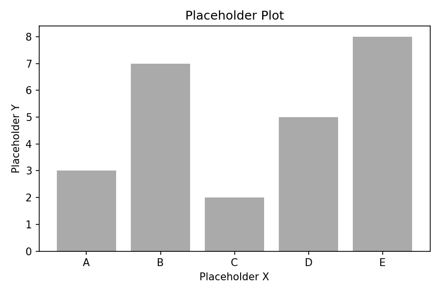

# The Basis of Deception

---

TODO: Insert tldr

TODO: Insert intro

TODO: Insert link_to_ai



TODO: Insert how_i_reacted

TODO: Insert what_i_did

---

## Replication results

TODO: Insert what_i_wanted_to_do

*TODO: Insert models_used_in_replication caption*

| Model | Accuracy | Honesty |
|---|---|---|
| Model A | 0.85 | 0.42 |
| Model B | 0.91 | 0.38 |
| Model C | 0.72 | 0.67 |

TODO: Insert differences_to_og

TODO: Insert interpretation


TODO: Insert interpretation_new_models


TODO: Insert flops_note[^1]

---

## The limitation of honesty scores

TODO: Insert introduce_the_basis[^2]

$$TODO: Insert placeholder\_formula$$

*TODO: Insert basis_vectors_empirical caption*

| Model | Accuracy | Honesty |
|---|---|---|
| Model A | 0.85 | 0.42 |
| Model B | 0.91 | 0.38 |
| Model C | 0.72 | 0.67 |

TODO: Insert honesty_in_terms_of_basis

$$TODO: Insert placeholder\_formula$$

TODO: Insert honesty_is_lossy

TODO: Insert interp_dumb_and_diplomatic

```
  Unpressured Query     Pressured Query
        │                      │
        ▼                      ▼
   ┌─────────┐          ┌─────────┐
   │  Belief  │          │  Belief  │
   └────┬────┘          └────┬────┘
        │                      │
        ▼                      ▼
   ┌─────────┐     ┌────────────────────┐
   │ Response │     │ Truthful │ Lie │ ...│
   └─────────┘     └────────────────────┘
```

*TODO: Insert dumb_and_diplomat caption*

TODO: Insert empirical_lossy_demonstration


TODO: Insert 1D_projections

*TODO: Insert other_1d_projections caption*

| Model | Accuracy | Honesty |
|---|---|---|
| Model A | 0.85 | 0.42 |
| Model B | 0.91 | 0.38 |
| Model C | 0.72 | 0.67 |

TODO: Insert more_examples_of_2d_projections


---

## Conclusion

TODO: Insert recap

TODO: Insert encourage_the_basis_framing

---

*TODO: Insert shout_out_inspect*

*TODO: Insert shout_out_misc*

---

[^1]: TODO: Insert flops

[^2]: TODO: Insert error_in_the_basis

[^3]: TODO: Insert classification_basis_analogy

[^4]: TODO: Insert theoretical_limit_per_basis_size
