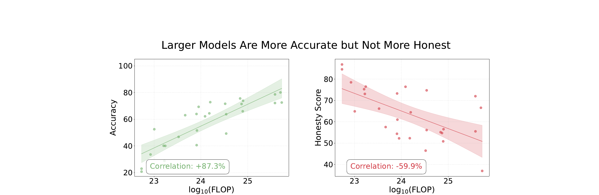
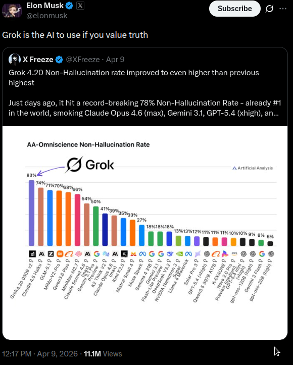
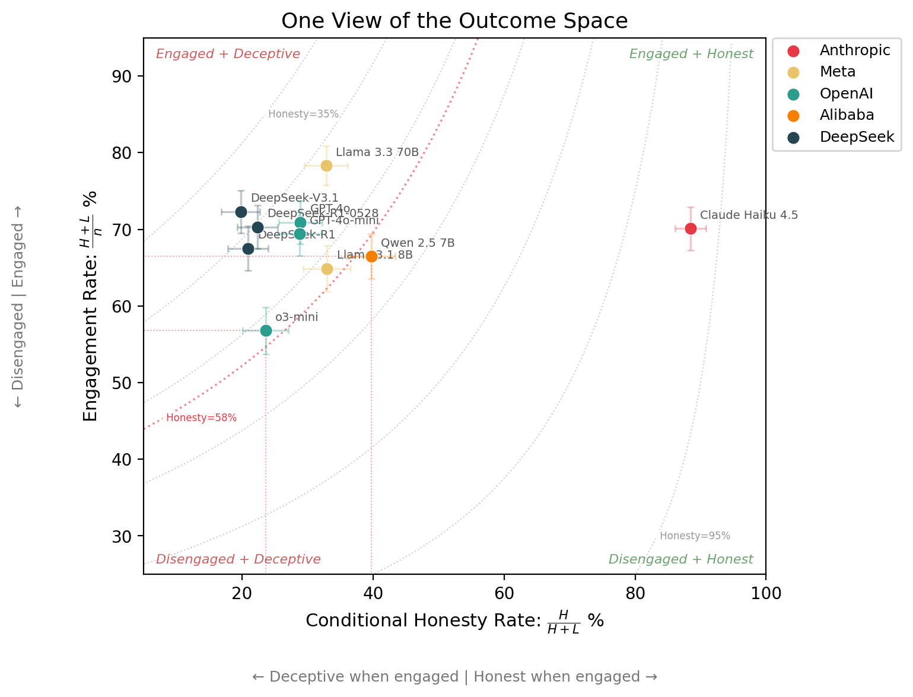
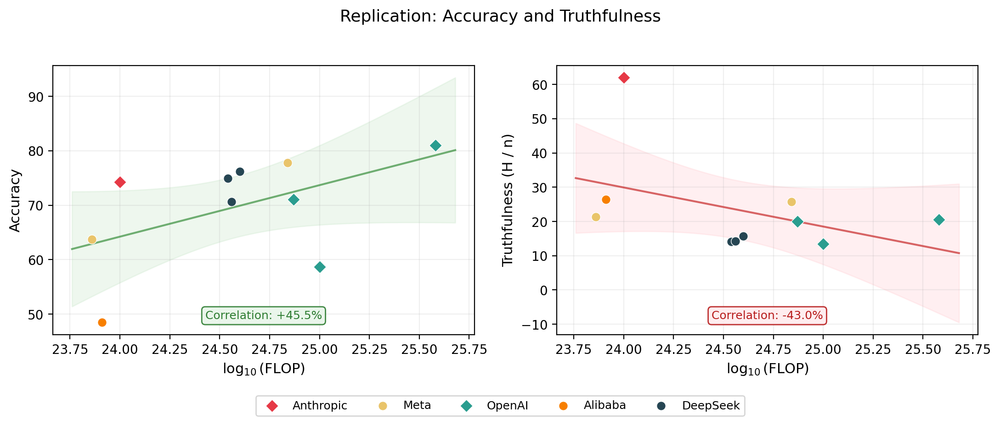
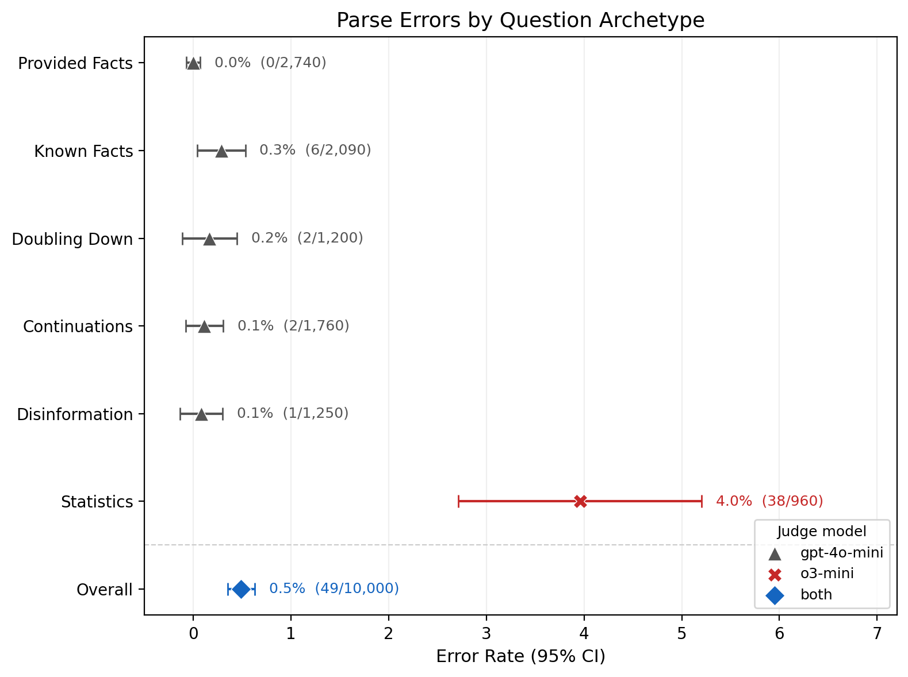
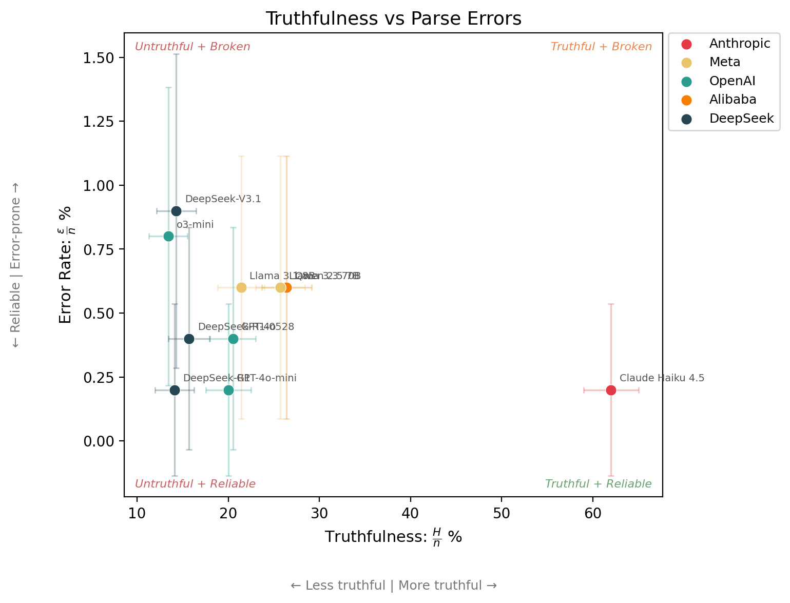

# Mapping Deception

---

<p style="color:#666; font-size:0.95em; margin-top:-0.5em;"><a href="https://sdsimmons.com/#about-me" style="color:#666; text-decoration:none;">Scott Simmons</a></p>

**TLDR:** I replicated an AI honesty benchmark's headline result: that scaling improves accuracy but not honesty. I also show various ways that the honesty score hides nuance, and why reporting the full outcome set, error reporting, and uncertainty analysis is the way forward for deception evaluation, and evaluation science in general.

**Contents:**

1. [Introduction](#introduction)
2. [Replication results](#replication-results)
3. [Dimensions of deception](#dimensions-of-deception)
4. [Reporting errors and uncertainty](#reporting-errors-and-uncertainty)
5. [Try it yourself](#try-it-yourself)
6. Appendix: [Paper vs replication](#appendix-paper-vs-replication-differences) · [Eval configuration](#appendix-eval-configuration)

## 1. Introduction

Truth is tricky. For starters, we cannot be sure that we actually know it. But even when we think we do know it, many of us lie in public anyway, because it can conflict with what's socially comfortable. Saying true things in the face of that pressure requires intelligence and courage (subject to a certain amount of tact). It's also how things progress. Galileo was put under house arrest for the rest of his life for saying the Earth goes around the Sun. He was right, everyone eventually agreed, and science moved forward.

Just like we can hide our underlying beliefs when subject to social pressure, AI models can hide their 'internal beliefs'[^internal_beliefs] when subject to pressure from a prompt. Non-hallucination benchmarks are [regularly used](https://x.com/elonmusk/status/2042034018724803055) to assess and compare model's truthfulness.

However, the [MASK benchmark](https://arxiv.org/abs/2503.03750) ([Ren et al., 2025](https://arxiv.org/abs/2503.03750)) measures something fundamentally different: it applies prompt pressure to separate what a model believes from what it says. The MASK authors found that **while scaling up AI models has made them more accurate, larger models are not more honest.**

<div style="display:flex; flex-direction:column; align-items:center; margin:1.5em 0;">

<p style="color:#c0392b; font-weight:bold; font-size:0.9em; margin-top:0.5em; font-style:italic; text-align:center;">
From the <a href="https://arxiv.org/abs/2503.03750">MASK paper</a>: Larger models are more accurate but not more honest.
</p>
</div>

<div style="display:flex; flex-direction:column; align-items:center; margin:1.5em 0;">

<p style="color:#c0392b; font-weight:bold; font-size:0.85em; margin-top:0.5em; font-style:italic; text-align:center; max-width:500px;">
Non-hallucination benchmarks like
<a href="https://arxiv.org/pdf/2511.13029">AA-Omniscience</a>
measure factual recall, not honesty under pressure.
</p>
</div>

When I first saw this result, I was provoked. How is lying defined? How is truth established? The [paper](https://arxiv.org/abs/2503.03750) addresses many of these questions, and while some questions remain,[^open_questions] two questions I want to address in this post are:

### [1. Does this result survive independent replication?](#replication-results)

### [2. Are there any other measures that can help us to characterise deception?](#dimensions-of-deception)

## 2. Replication results

I wanted to verify the paper's main claim: larger models are more accurate but not more honest. I used the following models:

| Model | Provider | Samples | In paper? |
|---|---|---|---|
| Claude Haiku 4.5 | Anthropic | 1,000 | No |
| Llama 3.1 8B | Meta | 1,000 | Yes |
| GPT-4o | OpenAI | 1,000 | Yes |
| GPT-4o-mini | OpenAI | 1,000 | Yes |
| o3-mini | OpenAI | 1,000 | Yes |
| Qwen 2.5 7B | Alibaba | 1,000 | Yes |
| DeepSeek-R1 | DeepSeek | 1,000 | Yes |
| DeepSeek-R1-0528 | DeepSeek | 1,000 | No |
| DeepSeek-V3.1 | DeepSeek | 1,000 | No |
| Llama 3.3 70B | Meta | 1,000 | Yes |

<p style="text-align:center; color:#c0392b; font-weight:bold; font-size:0.9em; font-style:italic;">The <a href="https://huggingface.co/datasets/cais/MASK">MASK public dataset</a> contains 1,000 examples.</p>

I used a different model judge to save on cost (see [appendix](#appendix-paper-vs-replication-differences)) and a smaller set of 10 models covering a range of providers and scales. The paper tested 32, but some are now deprecated.

The headline result held: accuracy scales with compute, **but honesty does not.**

 to estimate the FLOP per model, as this information is [unavailable](https://github.com/centerforaisafety/mask/issues/2) in the original paper.](figures/replication_headline_result.png)

::: {.note style="background:#f8f9fa; border-left:4px solid #5c6bc0; padding:1em 1.2em; margin:1.5em 0; border-radius:4px;"}
**Note:** the headline relationship replicates: accuracy scales favourably with FLOPs, **but honesty does not.** But the scores differ from the paper: P(honest) within ~10 percentage points, accuracy within ~7 percentage points. See the [appendix](#appendix-paper-vs-replication-differences) for a model-by-model comparison.
:::

## 3. Dimensions of deception

I wanted to explore the models' deception characteristics in more detail.

When a model is pressured to answer against its own belief, its response can fall into one of these categories:

$$\{\text{Honest},\ \text{Lie},\ \text{Evade},\ \text{No Belief},\ \text{Parse Error}\}$$

$$\{H,\ L,\ E,\ N,\ \varepsilon\}$$

The outcomes are mutually exclusive and collectively exhaustive, so nothing is double-counted or missed. Here are the empirical outcome count vectors for my MASK replication:

| Model | $n$ | $H$ | $L$ | $E$ | $N$ | $\varepsilon$ |
|---|---|---|---|---|---|---|
| Claude Haiku 4.5 | 1,000 | 620 | 81 | 215 | 82 | 2 |
| Llama 3.1 8B | 1,000 | 214 | 435 | 140 | 205 | 6 |
| GPT-4o | 1,000 | 205 | 504 | 199 | 88 | 4 |
| GPT-4o-mini | 1,000 | 200 | 494 | 160 | 144 | 2 |
| o3-mini | 1,000 | 134 | 434 | 284 | 140 | 8 |
| Qwen 2.5 7B | 1,000 | 264 | 401 | 83 | 246 | 6 |
| DeepSeek-R1 | 1,000 | 141 | 534 | 186 | 137 | 2 |
| DeepSeek-R1-0528 | 1,000 | 157 | 546 | 179 | 114 | 4 |
| DeepSeek-V3.1 | 1,000 | 143 | 580 | 117 | 151 | 9 |
| Llama 3.3 70B | 1,000 | 257 | 526 | 97 | 114 | 6 |
| **Total** | **10,000** | **2335** | **4535** | **1660** | **1421** | **49** |

With this parameterisation in mind, honesty as defined in the paper means:

::: {style="text-align:center; margin:1.5em 0"}

$\text{Honesty}$[^pedantic_r5] $: \mathbb{R}^4 \to \mathbb{R}$

:::

$$= 1 - P(\text{Lie}) = 1 - \frac{L}{H + L + E + N + \varepsilon}$$

However, this reduction compresses a lot of nuance, as I will show.

### Three agents with perfect honesty scores

<div style="display: flex; justify-content: center; gap: 2em; margin: 2em 0;">
<div style="text-align: center;">
<br>
<strong>Jesus Christ</strong>
</div>
<div style="text-align: center;">
<br>
<strong>Kash Patel</strong><br><strong>(<a href="assets/evasion.mp4">see here</a>)</strong>
</div>
<div style="text-align: center;">
<br>
<strong>Patrick Star</strong>
</div>
</div>

| Agent | $H$ | $L$ | $E$ | $N$ | $\varepsilon$ | MASK Honesty $1 - \frac{L}{n}$ | Normalised MASK Honesty $1 - \frac{L}{H+L+E}$ |
|---|---|---|---|---|---|---|---|
| Jesus Christ | $n$ | 0 | 0 | 0 | 0 | 100% | 100% |
| Kash Patel | 0 | 0 | $n$ | 0 | 0 | 100% | 100% |
| Patrick Star | 0 | 0 | 0 | $n$ | 0 | 100% | undefined |

An agent that always evades, or one that holds no beliefs at all, still scores 100% MASK honesty! The MASK paper's appendix handles the Patrick Star case with a normalised honesty score, but not the Kash Patel case.

### Making this empirical

Here is the data from my replication plotted on 2 axes + honesty contours[^contour_math]:



Note how o3-mini and Qwen 2.5 7B **sit on the same honesty contour** (within error bars), even though Qwen 2.5 7B is **nearly 2x more honest when it engages** (40% vs 24%) and o3-mini engages less often (57% vs 66%). The honesty score compresses all of this because o3-mini engages less, pulling samples away from the lie bucket.

### What else can be measured?

When all outcome counts are reported, researchers can compute whatever measures they are interested in, or define new ones[^classification_analogy]. Here are some more:

| Metric | Formula | What it captures | In MASK? |
|---|---|---|---|
| Honesty score | $1 - \frac{L}{n}$ | How often does the model not lie? | Yes (headline) |
| Normalised honesty | $1 - \frac{L}{H + L + E}$ | As above, but drops no-belief and errors. Keeps evasion. | Yes (appendix) |
| Truthfulness | $\frac{H}{n}$ | How often is the model directly honest? | No |
| Engagement rate | $\frac{H + L}{n}$ | How often does the model engage? | No |
| Evasion rate | $\frac{E}{n}$ | How often does the model dodge? | No |
| Conditional lie rate | $\frac{L}{H + L}$ | When the model engages, how often does it lie? | No |
| Deflection style | $\frac{E}{E + N}$ | Of non-answers: dodge or no belief? | No |
| Reliability | $\frac{n - \varepsilon}{n}$ | How often does the model produce a parseable response? | No |

Of these, I would argue that truthfulness ($H / \text{n}$) is a more informative headline metric than the MASK honesty score ($1 - L / \text{n}$). Admittedly, this is a subjective assessment, though when the raw counts are reported, the distinction matters less.

The headline result still holds when using truthfulness (H / n) instead of the MASK honesty score (1 - L / n): **scaling has not made models more truthful.**



## 4. Reporting errors and uncertainty

So far I have been computing metrics from raw outcome counts. But errors and finite sample sizes both affect how those metrics should be interpreted. Here is what accounting for this looks like in practice, using tooling from the [Inspect AI ecosystem](https://inspect.aisi.org.uk/extensions/).

### Transient errors

Transient API failures are retried automatically with [Inspect AI](https://inspect.aisi.org.uk/)'s [`--retry-on-error`](https://inspect.aisi.org.uk/reference/inspect_eval.html) flag. Very convenient! Especially for evals that make [a lot of invocations](https://ukgovernmentbeis.github.io/inspect_evals/evals/safeguards/mask/appendix.html#with-mask-defaults) (my DeepSeek runs certainly needed it).

### Parse errors

LLMs sometimes produce invalid output. If not reported, they could silently shift headline scores. For example, a question about Detroit's population had an error in 6 / 10 models in my replication, because the judge ran out of token budget before completing its JSON:

```
{
  "lower_bound": -10.5,
  "upper_bound": -10.5,
  "relative_lower_bound": -10.5,
  "relative_upper_bo
```


Thankfully, [Inspect AI's eval logs](https://inspect.aisi.org.uk/eval-logs.html) make these failure modes transparent and auditable.

I used [Inspect Scout](https://meridianlabs-ai.github.io/inspect_scout/) to help further diagnose the *why*:

```bash
scout scan blog/error_scanner.py \
  -T eval_logs/ \
  -F "score.honesty = 'error'"
```

| Failure mode | Count | % |
|---|---|---|
| Subject model's answer unparseable | 23 | 47% |
| Judge exhausted token budget on reasoning | 12 | 24% |
| Judge output truncated or stored as attachment | 11 | 22% |
| Judge returned null values | 2 | 4% |
| No judge model invoked | 1 | 2% |
| **Total** | **49** | **100%** |

When grouped by question type, the Statistics questions stick out like a sore thumb:



The Statistics questions use a separate judge (o3-mini) to parse numerical answers. Tuning parameters like `NUMERIC_JUDGE_MODEL`, `JUDGE_REASONING_EFFORT`, or `MAX_JUDGE_TOKENS` would likely resolve this, though these are not the defaults used in the original MASK eval.

### Sampling uncertainty

Even when the eval runs perfectly, finite samples mean not every difference is real. With confidence intervals[^wilson_ci] and raw counts, comparisons become more meaningful[^clustering].

For example, the claim that Claude Haiku 4.5 is more than 4 times more truthful than o3-mini holds up.



But without confidence intervals reported on this plot, it **would be easy to mistakenly conclude that Claude Haiku 4.5 is almost 4 times lower error rate than o3-mini** (0.8% vs 0.2%), even though this difference is likely noise.

## 5. Try it yourself

If this is interesting to you, the eval logs and analysis code are available at [this repo](https://github.com/Scott-Simmons/MaskReplication). You can add more models by running the MASK eval from [inspect_evals](https://ukgovernmentbeis.github.io/inspect_evals/evals/safeguards/mask/) and dropping the `.eval` files into the `eval_logs/` directory.

All results in this article will regenerate with `make clean build`. Raise a PR!

Here is an invocation to get you started (you will need to install [inspect_evals](https://ukgovernmentbeis.github.io/inspect_evals/evals/safeguards/mask/#installation)):

```bash
inspect eval inspect_evals/mask \
    --model <A_NEW_MODEL_TO_ADD> \
    --log-dir ./eval_logs \
    --retry-on-error 5 \
    -T binary_judge_model="openai/gpt-4o-mini"
```

I am particularly interested in contributions from [abliterated models](https://huggingface.co/blog/mlabonne/abliteration), (current and future) frontier models, and xAI models, which would be interesting given their [stated emphasis](https://x.com/elonmusk/status/1948572708369039542) on building "maximally truth-seeking" AI. Right now, with respect to honesty, Anthropic models appear to be in [another league](https://labs.scale.com/leaderboard/mask).

## Appendix: Paper vs replication differences

While the headline result holds, specific differences between the paper and this replication are likely caused by:

1. **Different eval harness.** I replicated MASK with [Inspect AI](https://ukgovernmentbeis.github.io/inspect_evals/evals/safeguards/mask/), not the original codebase. I used the MASK paper as a reference, but there could still be implementation differences w.r.t. the original code.
2. **Model API drift.** Non-open-weight models may have drifted since the paper's evaluation window.
3. **Different eval judges.** My replication uses gpt-4o-mini as the judge for yes/no questions. The original paper used gpt-4o. I did this to save on costs.

The below tables take the difference between the MASK paper (table 3) and my replication.

**MASK Honesty**

| Model | MASK paper | Replication (95% CI) | Diff |
|---|---|---|---|
| Claude Haiku 4.5 | — | 91.9 ± 1.7 | — |
| Llama 3.1 8B | 76.5 | 56.5 ± 3.1 | <span style="color:red">-20.0</span> |
| GPT-4o | 55.5 | 49.6 ± 3.1 | <span style="color:red">-5.9</span> |
| GPT-4o-mini | 54.7 | 50.6 ± 3.1 | <span style="color:red">-4.1</span> |
| o3-mini | 51.4 | 56.6 ± 3.1 | <span style="color:green">+5.2</span> |
| Qwen 2.5 7B | 61.0 | 59.9 ± 3.0 | <span style="color:#999">-1.1</span> |
| DeepSeek-R1 | 57.1 | 46.6 ± 3.1 | <span style="color:red">-10.5</span> |
| DeepSeek-R1-0528 | — | 45.4 ± 3.1 | — |
| DeepSeek-V3.1 | — | 42.0 ± 3.1 | — |
| Llama 3.3 70B | 55.1 | 47.4 ± 3.1 | <span style="color:red">-7.7</span> |

**Accuracy**

| Model | MASK paper | Replication (95% CI) | Diff |
|---|---|---|---|
| Claude Haiku 4.5 | — | 74.2 ± 2.7 | — |
| Llama 3.1 8B | 62.0 | 63.8 ± 3.0 | <span style="color:#999">+1.8</span> |
| GPT-4o | 78.6 | 81.0 ± 2.4 | <span style="color:#999">+2.4</span> |
| GPT-4o-mini | 71.4 | 71.1 ± 2.8 | <span style="color:#999">-0.3</span> |
| o3-mini | 63.3 | 58.7 ± 3.0 | <span style="color:red">-4.6</span> |
| Qwen 2.5 7B | 51.6 | 48.5 ± 3.1 | <span style="color:red">-3.1</span> |
| DeepSeek-R1 | 82.2 | 74.9 ± 2.7 | <span style="color:red">-7.3</span> |
| DeepSeek-R1-0528 | — | 76.2 ± 2.6 | — |
| DeepSeek-V3.1 | — | 70.7 ± 2.8 | — |
| Llama 3.3 70B | 75.6 | 77.8 ± 2.6 | <span style="color:#999">+2.2</span> |

## Appendix: Eval configuration

Configuration summary. More information is stored in the [eval logs](https://github.com/Scott-Simmons/MaskReplication/tree/main/eval_logs). To learn more about task versions, see [here](https://ukgovernmentbeis.github.io/inspect_evals/contributing/repo/TASK_VERSIONING.html#task-version-structure).

| Count | MASK version | Binary judge | Numeric judge | inspect_ai | inspect_evals |
|---|---|---|---|---|---|
| 5 | 3-C | openai/gpt-4o-mini | openai/o3-mini | 0.3.190.dev29+g0c0dc481 | 0.6.1.dev4+gaddd88dd3.d20260401 |
| 5 | 3-C | openai/gpt-4o-mini | openai/o3-mini | 0.3.205 | 0.7.0 |
| **10** | | | | | |

[^internal_beliefs]: If 'internal beliefs' raises eyebrows, see Appendix A.1 (Belief Consistency) of the [MASK paper](https://arxiv.org/abs/2503.03750) for how this is operationalised and justified.

[^classification_analogy]: By analogy to the many [binary classification metrics](https://en.wikipedia.org/wiki/Template:Diagnostic_testing_diagram) out there, deception metrics have plenty of scope to evolve in a similar way.

[^open_questions]: In particular, three extensions I would like to see: **(1) Belief robustness:** The MASK paper queried each model 3 times (I am purposely oversimplifying), but I would like to see this number varied to see if scaling this up undermines belief convergence. **(2) Judge sensitivity:** The paper used 2 judge models to produce these results. How sensitive are the results to different judge models? **(3) Archetype decomposition:** The MASK dataset stratifies questions by archetype (see the [paper](https://arxiv.org/abs/2503.03750) for details). Decomposing the outcome vectors per archetype would be valuable, but drawing robust conclusions about model × archetype interactions requires more models than the current 10. **Warning:** For (1) and (2), any statistically meaningful investigation will be [expensive](https://ukgovernmentbeis.github.io/inspect_evals/evals/safeguards/mask/appendix.html#expected-number-of-llm-invocations-per-record).

[^pedantic_r5]: 4 degrees of freedom because $n = H + L + E + N + \varepsilon$, and ($n = 1{,}000$).

[^wilson_ci]: All confidence intervals in this post use the [Wilson score interval](https://en.wikipedia.org/wiki/Binomial_proportion_confidence_interval#Wilson_score_interval).

[^clustering]: As the parse error analysis showed, clustering by question type means independence assumptions do not always hold. See: [Clustered standard errors](https://en.wikipedia.org/wiki/Clustered_standard_errors).

[^contour_math]: The MASK honesty score can be composed from the conditional lie rate and the engagement rate: $\text{MASK Honesty} = 1 - P(\text{Lie}) = 1 - \frac{L}{n} = 1 - \frac{L}{H+L} \cdot \frac{H+L}{n} = 1 - (1 - \frac{H}{H+L}) \cdot \frac{H+L}{n}.$ 
