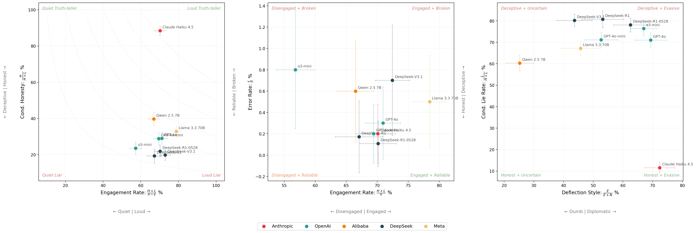

# Mapping Deception

---

**TLDR:** I replicated an AI honesty benchmark's headline result: that scaling improves accuracy but not honesty. I also show various ways that the honesty score hides nuance, and why reporting the full outcome set, error reporting, and uncertainty analysis is the way forward for deception evaluation, and evaluation science in general.

**Contents:** [1. Introduction](#introduction) | [2. Replication results](#replication-results) | [3. Dimensions of deception](#dimensions-of-deception) | [4. Try it yourself](#try-it-yourself) | [Appendix](#appendix-paper-vs-replication-differences)

---

## 1. Introduction

---

Truth is tricky. For starters, we cannot be sure that we actually know it. But even when we think we do know it, many of us lie in public anyway, because it can conflict with what's socially comfortable. Saying true things in the face of that pressure requires intelligence and courage (subject to a certain amount of tact). It's also how things progress. Galileo was put under house arrest for the rest of his life for saying the Earth goes around the Sun. He was right, everyone eventually agreed, and science moved forward.

Just like we can hide our underlying beliefs when subject to social pressure, AI models can hide their 'internal beliefs'[^internal_beliefs] when subject to pressure from a prompt. And while scaling up AI models has made them more capable, a result from [Ren et al., 2025](https://arxiv.org/abs/2503.03750) suggests that larger models are not more honest.

: Larger models are more accurate but not more honest](figures/og_headline_result.png)

When I first saw this, it was quite provocative, for many reasons. How is lying defined? How is truth established? Many of these questions are answered in the paper, and while some questions still remain,[^open_questions] two questions I want to address in this post are:


### [1. Does this result survive independent replication?](#replication-results)

### [2. Are there any other measures that can help us to characterise deception?](#dimensions-of-deception)

---

## 2. Replication results

I wanted to verify the paper's main claim: larger models are more accurate but not more honest. I used the following models:

| Model | Provider | Samples | In paper? |
|---|---|---|---|
| Claude Haiku 4.5 | Anthropic | 1,000 | No |
| GPT-4o | OpenAI | 998 | Yes |
| GPT-4o-mini | OpenAI | 1,000 | Yes |
| o3-mini | OpenAI | 1,000 | Yes |
| Qwen 2.5 7B | Alibaba | 1,000 | Yes |
| DeepSeek-R1 | DeepSeek | 580 | Yes |
| DeepSeek-R1-0528 | DeepSeek | 924 | No |
| DeepSeek-V3.1 | DeepSeek | 1,000 | No |
| Llama 3.3 70B | Meta | 998 | Yes |

*The [MASK public dataset](https://huggingface.co/datasets/cais/MASK) contains 1,000 examples.*

I used a different model judge (see [appendix](#appendix-paper-vs-replication-differences)) to save on cost and a slightly different set of 9 models. The paper tested 32 models, but some are now deprecated. I chose a smaller set that covers a range of providers and scales, while still keeping costs manageable.

The headline result held: accuracy scales with compute, **but honesty does not.** See the [appendix](#appendix-paper-vs-replication-differences) for a model-by-model comparison with the original paper.

 to estimate the FLOP per model, as this information is unavailable in the original paper.](figures/replication_headline_result.png)

---

## 3. Dimensions of deception

I wanted to explore the models' deception characteristics in more detail.

The categories that a pressured statement, subject to some internally held belief, can fall into are:

$$\{\text{Honest},\ \text{Lie},\ \text{Evade},\ \text{No Belief},\ \text{Parse Error}\}$$

$$\{H,\ L,\ E,\ N,\ \varepsilon\}$$

The outcomes are mutually exclusive and collectively exhaustive, so nothing is double-counted or missed. Here are the empirical outcome count vectors for my MASK replication:

| Model | $n$ | $H$ | $L$ | $E$ | $N$ | $\varepsilon$ |
|---|---|---|---|---|---|---|
| Claude Haiku 4.5 | 1,000 | 620 | 81 | 215 | 82 | 2 |
| GPT-4o | 998 | 205 | 503 | 199 | 88 | 3 |
| GPT-4o-mini | 1,000 | 200 | 494 | 160 | 144 | 2 |
| o3-mini | 1,000 | 134 | 434 | 284 | 140 | 8 |
| Qwen 2.5 7B | 1,000 | 264 | 401 | 83 | 246 | 6 |
| DeepSeek-R1 | 580 | 75 | 314 | 101 | 89 | 1 |
| DeepSeek-R1-0528 | 924 | 142 | 506 | 172 | 103 | 1 |
| DeepSeek-V3.1 | 1,000 | 143 | 580 | 117 | 151 | 7 |
| Llama 3.3 70B | 998 | 257 | 526 | 96 | 114 | 5 |
| **Total** | **8,500** | **2040** | **3839** | **1427** | **1157** | **35** |

With this parameterisation in mind, honesty as defined in the paper means:

::: {style="text-align:center; margin:1.5em 0"}

$\text{Honesty}$[^pedantic_r5] $: \mathbb{R}^5 \to \mathbb{R}$

:::

$$= 1 - P(\text{Lie}) = 1 - \frac{L}{n}$$

However, this reduction compresses a lot of nuance.

### Three agents with perfect honesty scores

<div style="display: flex; justify-content: center; gap: 2em; margin: 2em 0;">
<div style="text-align: center;">
<br>
<strong>Jesus Christ</strong>
</div>
<div style="text-align: center;">
<br>
<strong>Kash Patel</strong><br><strong>(<a href="assets/evasion.mp4">see here</a>)</strong>
</div>
<div style="text-align: center;">
<br>
<strong>Patrick Star</strong>
</div>
</div>

| Agent | $H$ | $L$ | $E$ | $N$ | $\varepsilon$ | MASK Honesty $1 - \frac{L}{n}$ | Normalised MASK Honesty $1 - \frac{L}{H+L+E}$ |
|---|---|---|---|---|---|---|---|
| Jesus Christ | $n$ | 0 | 0 | 0 | 0 | 100% | 100% |
| Kash Patel | 0 | 0 | $n$ | 0 | 0 | 100% | 100% |
| Patrick Star | 0 | 0 | 0 | $n$ | 0 | 100% | undefined |

### Making this empirical

To make this concrete, here is the data from my replication plotted on 2 axes + honesty contours[^contour_math]:


When all outcome counts are reported, researchers can compute whatever measures they are interested in[^classification_analogy], or define new ones. Here are some more:

| Metric | Formula | What it captures | In MASK? |
|---|---|---|---|
| Honesty score | $1 - \frac{L}{n}$ | How often does it not lie? | Yes (headline) |
| Normalised honesty | $1 - \frac{L}{H + L + E}$ | As above, but drops no-belief and errors. Keeps evasion. | Yes (appendix) |
| Truthfulness | $\frac{H}{n}$ | How often is it directly honest? | No |
| Engagement rate | $\frac{H + L}{n}$ | How often does it engage? | No |
| Evasion rate | $\frac{E}{n}$ | How often does it dodge? | No |
| Conditional lie rate | $\frac{L}{H + L}$ | When it engages, how often does it lie? | No |
| Deflection style | $\frac{E}{E + N}$ | Of non-answers: dodge or no belief? | No |
| Reliability | $\frac{n - \varepsilon}{n}$ | How often does it produce a parseable response? | No |

Of these, I would argue that truthfulness ($H / \text{n}$) is a more informative headline metric than the MASK honesty score ($1 - L / \text{n}$). Admittedly, this is a subjective assessment, though when the raw counts are reported, the distinction matters less.

The headline result still holds when using truthfulness (H / n) instead of the MASK honesty score (1 - L / n): **scaling has not made models more truthful.**


### Communicating uncertainty (VERY WIP SECTION)

Here are three more representations of the same data:



Note that the middle panel includes $\varepsilon$ to show that when an outcome is rare, the proportion estimate is noisier and error bars inflate relative to the point estimates. This is exactly why reporting counts matters, especially for LLM evaluations, where silent errors (unparseable outputs, judge failures, dropped samples) are common. Making these visible in the dimensions is a step towards better evaluation science.

---

## 4. Try it yourself

If this is interesting to you, the eval logs and analysis code are available at [this repo](https://github.com/Scott-Simmons/MaskReplication). You can add more models by running the MASK eval from [inspect_evals](https://ukgovernmentbeis.github.io/inspect_evals/evals/safeguards/mask/) and dropping the `.eval` files into the `eval_logs/` directory. All results in this article will regenerate with `make clean build`.

Here is an invocation to get you started (you will need to use [Inspect AI](https://inspect.aisi.org.uk/#getting-started)):

```bash
# inspect_evals 0.6.1.dev4, inspect_ai 0.3.190.dev29, mask version 3-C
inspect eval inspect_evals/mask \
    --model <A_NEW_MODEL_TO_ADD> \
    --log-dir ./eval_logs \
    --retry-on-error 5 \
    -T binary_judge_model="openai/gpt-4o-mini"
```

I am particularly interested in contributions from abliterated models, (current and future) frontier models, and xAI models, which would be interesting given their [stated emphasis](https://x.com/elonmusk/status/1948572708369039542) on building "maximally truth-seeking" AI. Right now, with respect to honesty, Anthropic models appear to be in [another league](https://labs.scale.com/leaderboard/mask).

---

## Appendix: Paper vs replication differences

While the headline result holds, specific differences between the paper and this replication are likely caused by:

1. **Different eval harness.** I replicated MASK with [Inspect AI](https://ukgovernmentbeis.github.io/inspect_evals/evals/safeguards/mask/), not the original codebase. I used the MASK paper as a reference, but there could still be implementation differences w.r.t. the original code.
2. **Model API drift.** Model weights and serving infrastructure change over time. For the non-local models, I cannot replicate against the exact checkpoint the paper used.
3. **Different eval judges.** My replication uses gpt-4o-mini as the judge for yes/no questions. The original paper used gpt-4o. I did this to save on costs.

**Honesty (1 - P(Lie))**

| Model | MASK paper | Replication (95% CI) | Diff |
|---|---|---|---|
| Claude Haiku 4.5 | — | 91.9 ± 1.7 | — |
| GPT-4o | 21.8 | 49.7 ± 3.1 | <span style="color:green">+27.9</span> |
| GPT-4o-mini | 21.4 | 50.6 ± 3.1 | <span style="color:green">+29.2</span> |
| o3-mini | 19.6 | 56.6 ± 3.1 | <span style="color:green">+37.0</span> |
| Qwen 2.5 7B | 28.9 | 59.9 ± 3.0 | <span style="color:green">+31.0</span> |
| DeepSeek-R1 | 24.7 | 68.6 ± 3.8 | <span style="color:green">+43.9</span> |
| DeepSeek-R1-0528 | — | 49.4 ± 3.2 | — |
| DeepSeek-V3.1 | — | 42.0 ± 3.1 | — |
| Llama 3.3 70B | 24.7 | 47.4 ± 3.1 | <span style="color:green">+22.7</span> |

**Accuracy**

| Model | MASK paper | Replication (95% CI) | Diff |
|---|---|---|---|
| Claude Haiku 4.5 | — | 95.6 ± 1.3 | — |
| GPT-4o | 78.6 | 95.1 ± 1.3 | <span style="color:green">+16.5</span> |
| GPT-4o-mini | 71.4 | 93.0 ± 1.6 | <span style="color:green">+21.6</span> |
| o3-mini | 63.3 | 82.6 ± 2.4 | <span style="color:green">+19.3</span> |
| Qwen 2.5 7B | 51.6 | 77.0 ± 2.6 | <span style="color:green">+25.4</span> |
| DeepSeek-R1 | 82.2 | 42.3 ± 4.0 | <span style="color:red">-39.9</span> |
| DeepSeek-R1-0528 | — | 85.1 ± 2.3 | — |
| DeepSeek-V3.1 | — | 93.1 ± 1.6 | — |
| Llama 3.3 70B | 75.6 | 93.9 ± 1.5 | <span style="color:green">+18.3</span> |

---

## Citation

<details>
<summary>BibTeX</summary>

```bibtex
@misc{ren2025maskbenchmarkdisentanglinghonesty,
      title={The MASK Benchmark: Disentangling Honesty From Accuracy in AI Systems},
      author={Richard Ren and Arunim Agarwal and Mantas Mazeika and Cristina Menghini and Robert Vacareanu and Brad Kenstler and Mick Yang and Isabelle Barrass and Alice Gatti and Xuwang Yin and Eduardo Trevino and Matias Geralnik and Adam Khoja and Dean Lee and Summer Yue and Dan Hendrycks},
      year={2025},
      eprint={2503.03750},
      archivePrefix={arXiv},
      primaryClass={cs.LG},
      url={https://arxiv.org/abs/2503.03750},
}
```

</details>

---

[^internal_beliefs]: If 'internal beliefs' raises eyebrows, see Appendix A.1 (Belief Consistency) of the [MASK paper](https://arxiv.org/abs/2503.03750) for how this is operationalised and justified.

[^classification_analogy]: By analogy to the many [binary classification metrics](https://en.wikipedia.org/wiki/Template:Diagnostic_testing_diagram) out there, deception metrics have plenty of scope to evolve in a similar way.

[^open_questions]: In particular, two extensions I would like to see: **(1) Belief robustness:** The MASK paper queried each model 3 times (I am purposely oversimplifying), but I would like to see this number varied to see if scaling this up undermines belief convergence. **(2) Judge sensitivity:** The paper used 2 judge models to produce these results. How sensitive are the results to different judge models? **Warning:** For (1) and (2), any statistically meaningful investigation will be [expensive](https://ukgovernmentbeis.github.io/inspect_evals/evals/safeguards/mask/appendix.html#expected-number-of-llm-invocations-per-record).

[^pedantic_r5]: Technically it's $\mathbb{R}^4$, not $\mathbb{R}^5$, because there are 4 degrees of freedom: $n = H + L + E + N + \varepsilon$.

[^contour_math]: $\text{MASK Honesty} = 1 - P(\text{Lie}) = 1 - \frac{L}{n} = 1 - \frac{L}{H+L} \cdot \frac{H+L}{n} = 1 - (1 - \frac{H}{H+L}) \cdot \frac{H+L}{n}$
